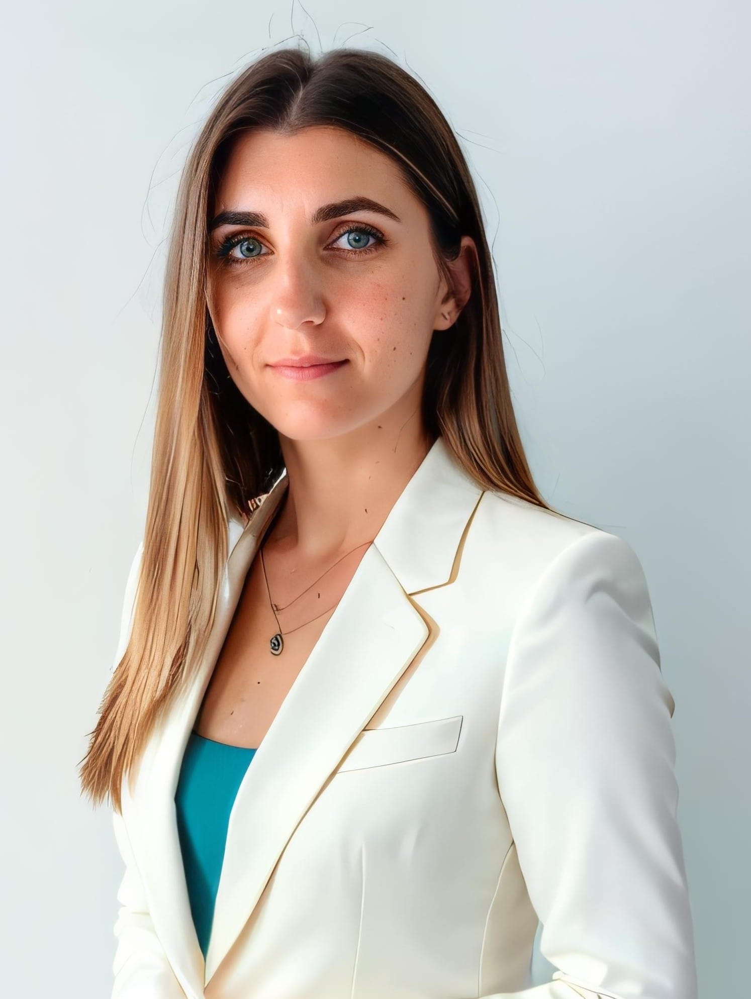
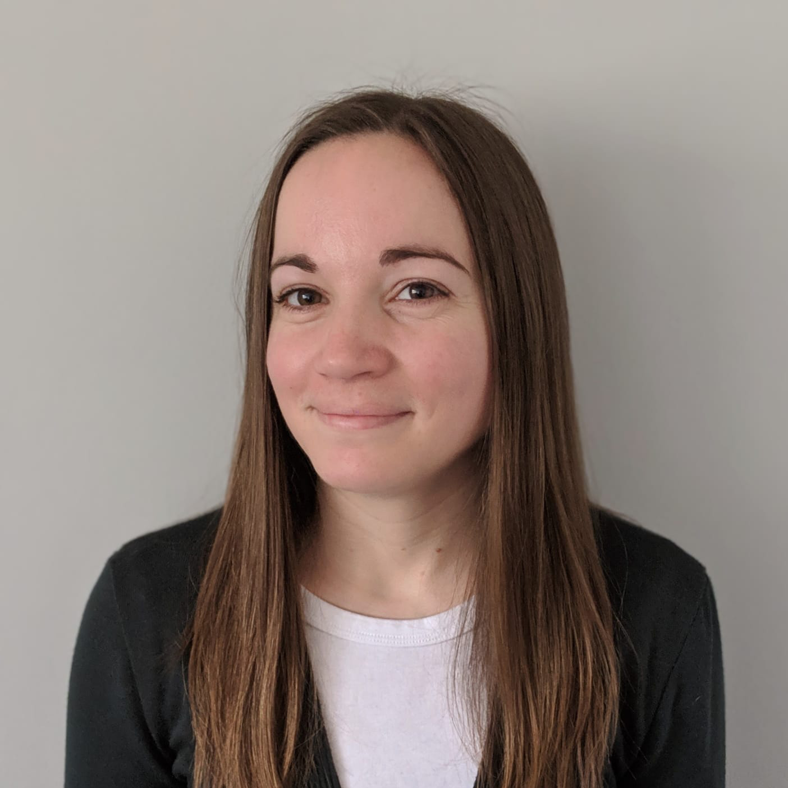

# Dani Dimitrova, LCSW
Hi, I’m Dani and I have been practicing as a licensed clinical social worker for the past 10 years, working with individuals and families to overcome challenges, heal trauma and relationships, and reconnect to self and others. I am passionate about helping people to live their most authentic and purposeful lives.

I work with people who struggle with anxiety, overwhelm, trauma, and those just feeling stuck or facing the same challenges over and over again. My intention is to empower individuals to develop tools to navigate and master their inner and outer worlds and create lasting change.

I will help you to explore your behaviors and relationships and gain the insight that you need to overcome destructive cycles and live the life that you want. We will investigate your unhelpful, often unconscious thoughts and beliefs. You will gain a deeper understanding of self and learn techniques to restructure your thoughts and manage your mind.

# Heather Elder, LMFT
Hi there, I'm Heather and I am a Licensed Marriage and Family Therapist, providing a compassionate space for individuals, couples, and families from all walks of life for the past 10 years. I approach therapy aiming to support my clients growth in order to break through unhealthy cycles and stop them from repeating.

I specialize in working with people who are struggling with anxiety, depression, transitions, grief and relationship issues. In regards to relationships, they are very complex whether it is with a friend, coworker, family member, or intimate partner and a lot of us need support in navigating various situations.

I firmly believe that change is within everyone, at this very moment. My role is to be a guide to help you sift through blockages that may be clouding your ability to tap into that change, whether those are past experiences, unhealthy thought patterns, or disconnection with self and others. Together, we can discover those barriers and reawaken your life to a newfound perspective and intention.
